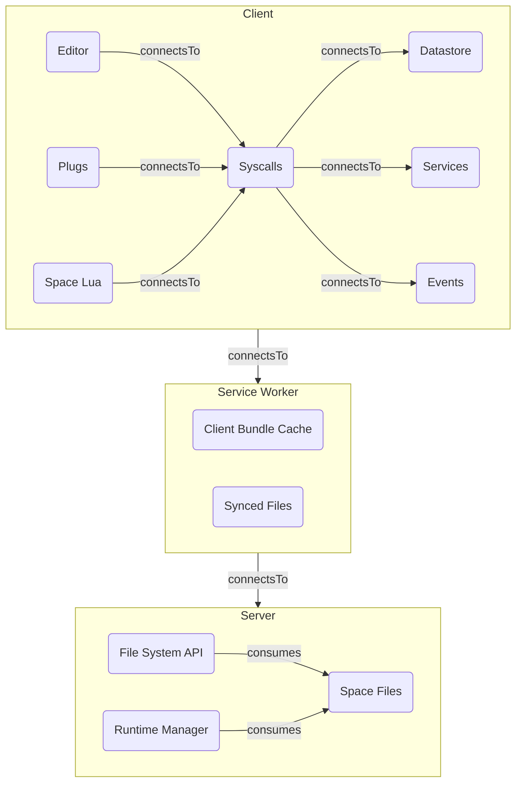

#development

This page describes the big-picture view of SilverBullet, assembled from its [[#Components]]. Each component has its own page describing how it relates to the others, the diagram below is generated on-the-fly from the meta data in those pages.

# Top-level Architecture
<!--#lua mermaid.diagram(mermaid.relationGraph{
  pages = query[[from index.pages("component")]],
  relations = {"connectsTo", "consumes"},
  groupBy = "partOf",
  direction = "TB"
}) -->

<!--/lua-->

# The three layers
* [[Architecture/Client]]: one instance per browser tab; runs 90%+ of the logic ([[Architecture/Editor|editor]], [[Architecture/Space Lua|Space Lua]], [[Architecture/Plugs|plugs]], [[Architecture/Syscalls|syscalls]], [[Architecture/Datastore|datastore]]).
* [[Architecture/Service Worker]]: one instance per browser; offline cache + [[Sync]].
* [[Architecture/Server]]: — authentication, serving the client, and the file [[HTTP API]], otherwise a dumb file store.

# Components
Every box in the diagram is a page tagged `component`:

<!--#lua query[[
  from p = index.pages("component")
  order by p.name
  select templates.pageItem(p)
]] -->
* [[Architecture/Client]]
* [[Architecture/Client Bundle Cache]]
* [[Architecture/Datastore]]
* [[Architecture/Editor]]
* [[Architecture/Events]]
* [[Architecture/File System API]]
* [[Architecture/Plugs]]
* [[Architecture/Runtime Manager]]
* [[Architecture/Server]]
* [[Architecture/Service Worker]]
* [[Architecture/Services]]
* [[Architecture/Space Files]]
* [[Architecture/Space Lua]]
* [[Architecture/Synced Files]]
* [[Architecture/Syscalls]]
<!--/lua-->

