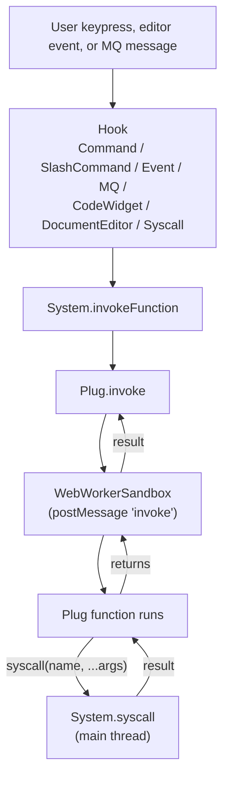

This page explains how plugs are loaded, executed, and isolated within SilverBullet. If you just want to build a plug, you can skip ahead to [[Plugs/Development/Reference]] and come back here when you need to understand *why* something behaves the way it does.

# Runtime model
At a “behind the scenes” level, a plug is a JavaScript bundle (`*.plug.js`) that exports `{manifest, functionMapping}`. It is compiled from a `*.plug.yaml` manifest plus the TypeScript files it references, it can also bundle additional asset files that can be loaded from inside the plug.

At load time, each plug runs in its own **Web Worker sandbox** in the browser. One worker per plug; each is fully isolated from the main thread and from other plugs. The plug never touches the DOM directly — all interaction with the editor, space, and storage goes through _syscalls_.

Two kinds of messages flow between the sandbox and the main thread:

* **Invoke** (main → worker): "run function `foo` with args X". Dispatched whenever a hook (command, event, slash command, MQ, code widget, document editor, syscall) fires for that plug.
* **Syscall** (worker → main): the plug calls `globalThis.syscall(name, ...args)` to reach editor APIs, storage, and so on. Plug authors don’t call this directly — importing from `@silverbulletmd/silverbullet/syscalls` generates these calls for you.

# Permissions
The manifest’s `requiredPermissions` list is stamped onto the plug when it loads. Syscalls that require a permission (currently `shell` and `fetch`) throw at call time if the plug didn’t declare the permission. Other syscalls — most of them — are available to every plug.

# End-to-end dispatch flow

The flow is the same regardless of which hook triggered the invocation.

# Plug discovery
Plugs are loaded the same regardless whether they are “built in” (= shipping with SilverBullet itself) or user installed plugs:

On boot, SilverBullet effectively just finds all files ending with `.plug.js` and loads them. Built-in plugs live under `Library/Std/Plugs`, which is part of the standard library file system that is overlaid on top of your space.
