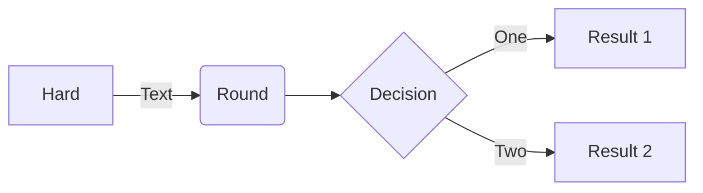

This is a pure [Space Lua](https://silverbullet.md) library that adds [Mermaid](https://mermaid.js.org/) support to SilverBullet. There is no compiled plug — everything (the IR serializer, the dynamic diagram builders, and the static ` ```mermaid ` block renderer) is implemented in the Space Lua block on this page.

For example:



**Note:** by default diagrams load Mermaid from a **CDN** (jsDelivr) — there is nothing to copy into your space, and installing this page is enough to start drawing. If you'd rather not depend on the CDN (e.g. for offline use or a fully self-hosted space), run the **`Mermaid: Download bundle for offline use`** command: it fetches a self-contained `mermaid.bundle.js` (an esbuild-bundled ESM build of Mermaid, ~2.6 MB) into your space and, once present, the renderer uses that **local copy automatically** instead of the CDN. The module is loaded with `js.import` directly into the main client context — there is no sandbox iframe — and is loaded **once per page** (cached by the JS module loader) and shared by every diagram on that page. Both static ` ```mermaid ` blocks and the dynamic API below share this loading path.

## Installation

This is a **library** (a `meta/library` page), not a plug — there is nothing to add to your `CONFIG`. Install it through SilverBullet's built-in **Library
Manager**:

1. Run the **`Library: Install`** command (or open the **Libraries** manager via the app menu / **`Libraries: Manager`** command and click **Install**).
2. When prompted for a library URI, paste the URL to the released library page:

 https://github.com/silverbulletmd/silverbullet-mermaid/releases/download/edge/Mermaid.md

Core writes this page into your space (under its frontmatter `name`, `Library/silverbullet-mermaid/Mermaid`). That single page is the whole library — **no asset is auto-installed**, and diagrams work immediately via the CDN. The library records its source URI, so later you can re-run **`Library: Update All`** to pull in new versions. If you need offline / CDN-free rendering, run the **`Mermaid: Download bundle for offline use`** command (see the note above); it fetches `mermaid.bundle.js` from the GitHub release into your space, after which it's used automatically.

> If you maintain a [Repository](https://silverbullet.md/Repository) that lists
> this library, it will also show up under **Available** in the Libraries
> manager, where it can be installed with one click.

## Static diagrams

Write a fenced `mermaid` block and move your cursor out of it to live-preview:

    ```mermaid
    flowchart TD
        Start --> Stop
    ```

## Dynamic diagrams (Space Lua API)

Besides static ` ```mermaid ` blocks, this library exposes a [Space Lua](https://silverbullet.md) API for generating diagrams **at runtime from your space's data** — they re-render when the data changes, exactly like query tables and lists.

### Quick start
A raw Mermaid string:

${mermaid.diagram("flowchart LR\n  A[\"Hello\"] --> B[\"World\"]")}

A relation graph built live from frontmatter (this is what the ADR board uses):
 ${mermaid.diagram(mermaid.relationGraph{
      pages = query[[from index.pages("adr")]],
      relations = {"dependsOn", "related", "supersededBy"},
    })}

### Functions

* **`mermaid.diagram(input, opts)`** → a rendered widget. `input` is a raw Mermaid string *or* a diagram **IR** table (see below). The widget has a Copy button (copies the generated source) and clickable nodes (each `click` element navigates to the named page). `opts` *(optional)* may contain `width`, `height`, `maxWidth` — CSS lengths (e.g. `"600px"`, `"50%"`) merged into the rendered `<svg>`'s inline style to scale it; the viewBox preserves aspect ratio. When `input` is an IR table, its own `width`/`height`/`maxWidth` fields are used as defaults, and `opts` overrides them.
* **`mermaid.toSource(input)`** → the Mermaid source string (no rendering) — useful for debugging or freezing a dynamic diagram into a static block. It delegates to `mermaid.serialize`, a **pure Lua** function defined in this library.

The three `mermaid.*` builders all take a **`pages`** list — a page-object list, typically produced by a `query[[…]]` expression such as `query[[from index.pages("adr")]]` — rather than a tag string. Each returns a diagram IR you pass to `mermaid.diagram`. Each builder spec also accepts optional `width`, `height`, `maxWidth` (CSS lengths) that are threaded onto the returned IR and applied at render time; an `opts` table passed to `mermaid.diagram` overrides them.

* **`mermaid.relationGraph{ pages, relations?, groupBy?, color?, direction?, max?, width?, height?, maxWidth? }`** → a flowchart IR. Node labels use the page's last path segment; clicking still navigates to the full page. Options:
 * `pages` — the page list to graph, e.g. `query[[from index.pages("adr")]]`.
 * `relations` *(optional)* — frontmatter fields holding `[[page]]` links to draw as edges, e.g. `{"dependsOn", "related"}`. A `supersededBy` relation is drawn dotted. **When omitted, all relations are auto-detected** — every frontmatter field whose value(s) are `[[links]]` to other pages in the set becomes an edge (labeled by the field name; the `groupBy` field is excluded, since it drives subgraph nesting). Pass an explicit `relations` list to restrict edges to specific fields.
 * `groupBy` *(optional)* — a frontmatter field naming a **container** page; members nest inside that container's **subgraph**. (The `Architecture` page uses `groupBy = "partOf"` to draw the Client / Service Worker / Server layers.)
 * `direction` *(optional)* — `"LR"` (default), `"TD"`, etc.
 * `color` *(optional)* — a frontmatter field whose value becomes a Mermaid CSS class on each node (e.g. `"status"`). Supply matching `classDef`s to style them; without them the nodes render unstyled. *(Auto-`classDef` from observed
 values is a planned enhancement.)*
 * `max` *(optional, default 60)* — node cap; a "showing N of M" note is added when exceeded.
* **`mermaid.timeline{ pages, dateField="date", groupBy="year"|"none", title?, labelField?, max?, width?, height?, maxWidth? }`** → a Mermaid `timeline` IR: pages laid out chronologically by a date field. (Mermaid timelines have no node click-through, so these entries are not clickable.) Options:
 * `pages` — the page list to lay out, e.g. `query[[from index.pages("journal")]]`.
 * `dateField` *(default `"date"`)* — frontmatter field holding the date (`YYYY-MM-DD…`); pages without a parseable date are skipped.
 * `groupBy` *(default `"year"`)* — `"year"` groups events under their year; `"none"` emits one entry per date.
 * `labelField` *(optional)* — frontmatter field to use as the event label (defaults to the page's last path segment).
 * `title` *(optional)* — diagram title.
 * `max` *(optional, default 100)* — event cap; a "showing N of M" note is added when exceeded.
* **`mermaid.distribution{ pages, by, title?, showData?, emptyLabel?, width?, height?, maxWidth? }`** → a Mermaid `pie` IR counting the given pages by a categorical frontmatter field (slices sorted count-descending). Options:
 * `pages` — the page list to count.
 * `by` *(required)* — the frontmatter field to count by, e.g. `"status"`.
 * `emptyLabel` *(optional)* — bucket label for pages missing/blank on `by`; omit to exclude them.
 * `title` *(optional)* — chart title.
 * `showData` *(optional)* — when truthy, renders the raw counts next to each slice (`pie showData`).

### Diagram IR — build any diagram

For full control, pass a table instead of a string. It's a generic *element-stream*: a `type` plus an ordered list of `elements`. Because a `raw` element passes a literal Mermaid line through untouched, **any** diagram Mermaid supports is expressible — structured element kinds are just sugar for the common graph cases.

 ${mermaid.diagram{
      type = "flowchart",
      direction = "LR",
      elements = {
        { kind = "node", id = "a", label = "Start", shape = "rounded" },
        { kind = "node", id = "b", label = "Done" },
        { kind = "edge", from = "a", to = "b", label = "go", arrow = true },
        { kind = "click", id = "a", target = "Some Page" },
        { kind = "raw",  text = "%% any literal mermaid line" },
      },
    }}

Element kinds:

| kind       | fields                                                                                            |
|------------|---------------------------------------------------------------------------------------------------|
| `node`     | `id`, `label?`, `shape?` (`rect`\|`rounded`\|`stadium`\|`circle`\|`diamond`\|`hexagon`), `class?` |
| `edge`     | `from`, `to`, `label?`, `style?` (`solid`\|`dotted`\|`thick`), `arrow?`                           |
| `subgraph` | `id`, `label?`, `elements`                                                                        |
| `classDef` | `name`, `style` (table of CSS props)                                                              |
| `click`    | `id`, `target` (page to navigate to)                                                              |
| `raw`      | `text` (literal Mermaid line — the escape hatch)                                                  |

Top level: `type` (e.g. `"flowchart"` — any Mermaid type), `direction?` (`"LR"`/`"TD"`/…), `title?`, `elements`.

### How it works

1. Your Lua builds the **IR** table (or a `mermaid.*` builder does, from a `pages` list you queried out of the object index).
2. `mermaid.diagram` serializes the IR to Mermaid source via `mermaid.serialize` — a **pure Lua** function (no DOM, no syscall) that owns id-sanitization, label escaping, and validation.
3. It loads Mermaid **in the main client context** (no sandbox iframe): it prefers a locally-installed `mermaid.bundle.js` when one is present in your space (offline / self-hosted), otherwise it imports from the CDN (jsDelivr). The module is cached by the loader, so Mermaid is loaded only **once per page** even with many diagrams. It calls `mermaid.render` to get an SVG string, injects `data-sb-ref` attributes onto clickable node groups, and returns a `widget.new{…}` whose `html` is that SVG.
4. Node clicks are handled by the widget's delegated `click` event: it finds the nearest element carrying a `data-sb-ref` and calls `editor.navigate(ref)`. (The serializer still emits Mermaid `click` lines, but under `securityLevel = "strict"` those are inert — navigation goes entirely through `data-sb-ref`.)
5. Static ` ```mermaid ` fenced blocks go through the very same path: at the end of this library's Space Lua block, `codeWidget.define{ language = "mermaid",
   render = … }` registers a Core code widget whose `render` simply calls `mermaid.diagram(body)`. So static and dynamic diagrams share one renderer.

So a diagram is just another **live view of the object index** — edit a page's frontmatter and the diagram redraws itself. The serializer owns the Mermaid syntax; the builders own the query and layout. 

# Implementation

```space-lua
mermaid = mermaid or {}

local NODE_WRAP = {
  rect = {"[", "]"},
  rounded = {"(", ")"},
  stadium = {"([", "])"},
  circle = {"((", "))"},
  diamond = {"{", "}"},
  hexagon = {"{{", "}}"},
}
local EDGE_OP = {
  solid = {arrow = "-->", plain = "---"},
  dotted = {arrow = "-.->", plain = "-.-"},
  thick = {arrow = "==>", plain = "==="},
}

-- Convert an arbitrary string into a valid Mermaid node identifier.
local function safeId(raw)
  local id = string.gsub(raw, "[^%w_]", "_")
  if not string.match(id, "^[%a_]") then id = "n_" .. id end
  return id
end

-- Quote a label and escape characters Mermaid can't take literally.
local function escapeLabel(text)
  return '"' .. string.gsub(text, '"', "#quot;") .. '"'
end

local function collectNodeIds(elements, into)
  for _, el in ipairs(elements) do
    if el.kind == "node" then
      into[safeId(el.id)] = true
    elseif el.kind == "subgraph" then
      -- a subgraph id is itself a valid edge endpoint
      into[safeId(el.id)] = true
      collectNodeIds(el.elements, into)
    end
  end
end

local function styleString(style)
  local keys = {}
  for k in pairs(style) do keys[#keys+1] = k end
  table.sort(keys)
  local parts = {}
  for _, k in ipairs(keys) do parts[#parts+1] = k .. ":" .. style[k] end
  return table.concat(parts, ",")
end

local function renderElements(elements, known, indent, lines)
  for _, el in ipairs(elements) do
    local kind = el.kind
    if kind == "node" then
      local wrap = NODE_WRAP[el.shape or "rect"]
      local label = escapeLabel(el.label or el.id)
      local cls = el.class and (":::" .. el.class) or ""
      lines[#lines+1] = indent .. safeId(el.id) .. wrap[1] .. label .. wrap[2] .. cls
    elseif kind == "edge" then
      local from = safeId(el.from)
      local to = safeId(el.to)
      -- Validate the source; targets may be undeclared (Mermaid auto-creates them).
      if not known[from] then error('edge references missing node "' .. from .. '"') end
      local op = EDGE_OP[el.style or "solid"]
      local conn = (el.arrow == false) and op.plain or op.arrow
      local lbl = el.label and ("|" .. escapeLabel(el.label) .. "|") or ""
      lines[#lines+1] = indent .. from .. " " .. conn .. lbl .. " " .. to
    elseif kind == "subgraph" then
      lines[#lines+1] = indent .. "subgraph " .. safeId(el.id) ..
        (el.label and (" [" .. escapeLabel(el.label) .. "]") or "")
      renderElements(el.elements, known, indent .. "  ", lines)
      lines[#lines+1] = indent .. "end"
    elseif kind == "classDef" then
      lines[#lines+1] = indent .. "classDef " .. el.name .. " " .. styleString(el.style) .. ";"
    elseif kind == "click" then
      lines[#lines+1] = indent .. "click " .. safeId(el.id) .. " call __sbNav(" .. escapeLabel(el.target) .. ")"
    elseif kind == "raw" then
      lines[#lines+1] = indent .. el.text
    else
      error("unknown element kind: " .. tostring(kind))
    end
  end
end

-- Serialize a Diagram IR into Mermaid source. Pure; no DOM.
function mermaid.serialize(diagram)
  local lines = {}
  if diagram.type == "flowchart" then
    lines[#lines+1] = "flowchart " .. (diagram.direction or "TD")
  else
    lines[#lines+1] = diagram.title and (diagram.type .. " title " .. diagram.title) or diagram.type
  end
  local known = {}
  collectNodeIds(diagram.elements, known)
  renderElements(diagram.elements, known, "  ", lines)
  return table.concat(lines, "\n")
end

-- IR table (or raw string) -> Mermaid source string.
function mermaid.toSource(input)
  if type(input) == "string" then
    return input
  end
  -- mermaid.serialize is a pure Lua function defined earlier in this block.
  return mermaid.serialize(input)
end

-- Collect {id, target} pairs from `click` elements anywhere in the IR
-- (recursing into subgraphs). These map Mermaid node ids → pages to navigate to.
local function collectClicks(elements, into)
  for _, el in ipairs(elements) do
    if el.kind == "click" then
      into[#into + 1] = { id = el.id, target = el.target }
    elseif el.kind == "subgraph" and el.elements then
      collectClicks(el.elements, into)
    end
  end
end

-- Escape Lua pattern magic characters so a value can be embedded in a pattern.
local function escapePattern(s)
  return (string.gsub(s, "([%^%$%(%)%%%.%[%]%*%+%-%?])", "%%%1"))
end

-- HTML-escape for use inside a double-quoted attribute value.
local function escapeAttrValue(s)
  s = string.gsub(s, "&", "&amp;")
  s = string.gsub(s, "\"", "&quot;")
  return s
end

-- Apply optional width/height/max-width (CSS lengths) to a rendered <svg> by
-- merging into the root tag's inline style. Mermaid's viewBox makes the SVG
-- scale to the new box (preserving aspect ratio).
local function applySize(svg, width, height, maxWidth)
  if not (width or height or maxWidth) then return svg end
  local extra = ""
  if width then extra = extra .. "width:" .. width .. ";" end
  if height then extra = extra .. "height:" .. height .. ";" end
  if maxWidth then extra = extra .. "max-width:" .. maxWidth .. ";" end
  -- `extra` may contain `%` (e.g. "50%"), which is special on gsub's
  -- replacement side — escape it to `%%`.
  local extraRepl = string.gsub(extra, "%%", "%%%%")
  -- Merge into an existing style="" on the root <svg ...> (appended → wins).
  local replaced, n = string.gsub(
    svg,
    '(<svg[^>]-style=")([^"]*)"',
    "%1%2;" .. extraRepl .. '"',
    1
  )
  if n == 0 then
    -- No style attr on the root svg; add one.
    replaced = string.gsub(svg, "(<svg)", '%1 style="' .. extraRepl .. '"', 1)
  end
  return replaced
end

local MERMAID_DEFAULTS = {
  cdnUrl = "https://cdn.jsdelivr.net/npm/mermaid@11.4.0/+esm",
  bundlePath = "Library/silverbullet-mermaid/mermaid.bundle.js",
  releaseUrl =
    "https://github.com/silverbulletmd/silverbullet-mermaid/releases/download/edge/mermaid.bundle.js",
}

-- Merge user config (config.set("mermaid", {...})) over the defaults.
local function mermaidConfig()
  local cfg = config.get("mermaid", {})
  return {
    cdnUrl = cfg.cdnUrl or MERMAID_DEFAULTS.cdnUrl,
    bundlePath = cfg.bundlePath or MERMAID_DEFAULTS.bundlePath,
    releaseUrl = cfg.releaseUrl or MERMAID_DEFAULTS.releaseUrl,
  }
end

-- Load the Mermaid ESM module: prefer a locally-installed bundle (offline,
-- self-hosted) when present, otherwise import from the CDN. The JS module loader
-- caches by URL, so this resolves+loads once per page.
local function importMermaid()
  local cfg = mermaidConfig()
  if space.fileExists(cfg.bundlePath) then
    return js.importFromSpace(cfg.bundlePath)
  end
  return js.import(cfg.cdnUrl)
end

-- IR table (or raw string) -> a rendered widget. Mermaid is imported into the
-- main client context via js.import (no sandbox iframe); we render to an SVG
-- string and inject `data-sb-ref` attributes onto node groups so clicks
-- navigate to the mapped page.
function mermaid.diagram(input, opts)
  opts = opts or {}
  local width = opts.width
  local height = opts.height
  local maxWidth = opts.maxWidth
  if type(input) == "table" then
    if width == nil then width = input.width end
    if height == nil then height = input.height end
    if maxWidth == nil then maxWidth = input.maxWidth end
  end

  local source = mermaid.toSource(input)

  -- Collect node→page click mappings from the IR (strings carry none).
  local clicks = {}
  if type(input) == "table" and input.elements then
    collectClicks(input.elements, clicks)
  end

  -- Theme follows the editor's theme.
  local theme = "default"
  local okTheme, t = pcall(function()
    return js.window.document.documentElement.dataset.theme
  end)
  if okTheme and t == "dark" then theme = "dark" end

  -- Unique, valid id per render (Mermaid requires a unique render id).
  mermaid._n = (mermaid._n or 0) + 1
  local id = "sb-mmd-" .. mermaid._n

  local svg
  local okRender, err = pcall(function()
    local m = importMermaid()
    m.initialize { startOnLoad = false, securityLevel = "strict", theme = theme }
    local res = m.render(id, source)
    svg = res.svg
  end)

  if not okRender or not svg then
    local msg = tostring(err)
    msg = string.gsub(msg, "&", "&amp;")
    msg = string.gsub(msg, "<", "&lt;")
    return widget.html("<pre class='sb-mmd-error'>Mermaid error: " .. msg .. "</pre>")
  end

  -- Inject data-sb-ref onto each clickable node group. Mermaid names a node's
  -- group <g> with an id that contains the source id (e.g. "flowchart-n1-0").
  for _, c in ipairs(clicks) do
    local nodeId = escapePattern(safeId(c.id))
    local page = escapeAttrValue(tostring(c.target))
    -- `%` is special in gsub replacement strings; escape it in the page value.
    local pageRepl = string.gsub(page, "%%", "%%%%")
    -- Match the node group's opening tag: <g ... id="...flowchart-<nodeId>-...">
    local pat = "(<g[^>]-id=\"[^\"]-flowchart%-" .. nodeId .. "%-[^\"]-\")"
    local replaced, n = string.gsub(svg, pat, "%1 data-sb-ref=\"" .. pageRepl .. "\"", 1)
    if n > 0 then svg = replaced end
    -- If the pattern didn't match, leave the svg unchanged (no error).
  end

  -- Apply optional sizing (from opts and/or the IR's own fields).
  svg = applySize(svg, width, height, maxWidth)

  return widget.new {
    html = svg,
    display = "block",
    markdown = "```mermaid\n" .. source .. "\n```",
    events = {
      click = function(e)
        -- `e.data` is the JS MouseEvent and `e.data.target` a DOM node
        -- (userdata). Space Lua's js bridge binds `this` on dot-access, so DOM
        -- methods must be called with `.method(...)`, NOT the Lua `:method(...)`
        -- colon syntax (which fails with "attempt to index a userdata value").
        local ok2, el = pcall(function()
          return e.data.target.closest("[data-sb-ref]")
        end)
        if ok2 and el then
          local ref = el.getAttribute("data-sb-ref")
          if ref and ref ~= "" then editor.navigate(ref) end
        end
      end,
    },
  }
end

-- Build a relation flowchart IR from frontmatter relations between tagged
-- pages.
-- spec: {
--   pages     = list,              -- page objects, e.g. query[[from index.pages("adr")]]
--   relations = {string, ...}?,    -- frontmatter fields holding [[links]] → edges;
--                                     omit to auto-detect every [[link]] field
--                                     (except groupBy) as an edge
--   groupBy   = string?,           -- frontmatter field naming a container page;
--                                     members nest inside that container's subgraph
--   color     = string?,           -- frontmatter field naming a classDef
--   direction = string?,           -- "LR" (default) | "TD" | ...
--   max       = number?,           -- node cap (default 60)
-- }
function mermaid.relationGraph(spec)
  spec = spec or {}
  local groupBy = spec.groupBy
  local max = spec.max or 60

  -- Strip surrounding [[ ]] from a wiki-link value (first value if a list).
  local function deref(v)
    if type(v) == "table" then v = v[1] end
    if type(v) ~= "string" then return nil end
    v = string.gsub(v, "^%[%[", "")
    v = string.gsub(v, "%]%]$", "")
    return v
  end

  -- Gather + sort the pages for deterministic output.
  local pages = {}
  for _, p in ipairs(spec.pages or {}) do pages[#pages + 1] = p end
  table.sort(pages, function(a, b)
    return string.lower(a.name or "") < string.lower(b.name or "")
  end)

  -- Assign stable ids (respecting the cap).
  local idOf, order, shown = {}, {}, 0
  for _, p in ipairs(pages) do
    if shown >= max then break end
    shown = shown + 1
    idOf[p.name] = "n" .. shown
    order[#order + 1] = p
  end

  -- Node labels use the last path segment (e.g. "Architecture/Editor" → "Editor")
  -- for a clean diagram; click-through still targets the full page name.
  local function shortName(n)
    return (string.match(n, "[^/]+$")) or n
  end
  local function nodeEl(p)
    return {
      kind = "node",
      id = idOf[p.name],
      label = shortName(p.name),
      shape = "rounded",
      class = spec.color and p[spec.color] or nil,
    }
  end
  local function clickEl(p)
    return { kind = "click", id = idOf[p.name], target = p.name }
  end

  local elements = {}

  if groupBy then
    -- Partition pages into containers (anything that is `groupBy`-linked to) and
    -- their members; containers render as subgraphs wrapping their members.
    local childrenOf, isContainer = {}, {}
    for _, p in ipairs(order) do
      local c = deref(p[groupBy])
      if c and idOf[c] then
        childrenOf[c] = childrenOf[c] or {}
        table.insert(childrenOf[c], p)
        isContainer[c] = true
      end
    end
    local emitted = {}
    for _, p in ipairs(order) do
      if isContainer[p.name] and not emitted[p.name] then
        local subEls = {}
        for _, child in ipairs(childrenOf[p.name]) do
          subEls[#subEls + 1] = nodeEl(child)
          subEls[#subEls + 1] = clickEl(child)
          emitted[child.name] = true
        end
        elements[#elements + 1] = {
          kind = "subgraph", id = idOf[p.name], label = shortName(p.name), elements = subEls,
        }
        emitted[p.name] = true
      end
    end
    -- Anything not nested in a rendered container → top-level node.
    for _, p in ipairs(order) do
      if not emitted[p.name] then
        elements[#elements + 1] = nodeEl(p)
        elements[#elements + 1] = clickEl(p)
      end
    end
  else
    for _, p in ipairs(order) do
      elements[#elements + 1] = nodeEl(p)
      elements[#elements + 1] = clickEl(p)
    end
  end

  -- Draw edges for one frontmatter field of a page. In auto mode (relations
  -- omitted) only [[wiki-link]] values count as relations; in explicit mode any
  -- value in the named field is dereferenced (preserving the prior behavior).
  local function addEdges(fromId, field, value, requireLink)
    if type(value) == "string" then value = { value } end
    if type(value) ~= "table" then return end
    for _, t in ipairs(value) do
      if type(t) == "string" and (not requireLink or string.match(t, "^%[%[")) then
        local toId = idOf[deref(t)]
        if toId and toId ~= fromId then
          elements[#elements + 1] = {
            kind = "edge",
            from = fromId,
            to = toId,
            label = field,
            arrow = true,
            style = (field == "supersededBy") and "dotted" or "solid",
          }
        end
      end
    end
  end

  -- Edges, between any rendered ids (a subgraph id is a valid endpoint too).
  for _, p in ipairs(order) do
    local fromId = idOf[p.name]
    if fromId then
      if spec.relations then
        -- explicit list of relation fields
        for _, rel in ipairs(spec.relations) do
          addEdges(fromId, rel, p[rel], false)
        end
      else
        -- auto-detect: every [[link]] field pointing into the set, except the
        -- groupBy field (which is rendered as subgraph nesting).
        for key, value in pairs(p) do
          if type(key) == "string" and key ~= groupBy then
            addEdges(fromId, key, value, true)
          end
        end
      end
    end
  end

  if shown < #pages then
    elements[#elements + 1] = {
      kind = "raw",
      text = "%% showing " .. shown .. " of " .. #pages .. " nodes",
    }
  end

  return {
    type = "flowchart",
    direction = spec.direction or "LR",
    elements = elements,
    width = spec.width,
    height = spec.height,
    maxWidth = spec.maxWidth,
  }
end

-- Chronological timeline from a date-bearing page list.
-- spec: { pages, dateField="date", groupBy="year"|"none", title?, labelField?, max=100 }
function mermaid.timeline(spec)
  spec = spec or {}
  local dateField = spec.dateField or "date"
  local groupBy = spec.groupBy or "year"
  local max = spec.max or 100

  local function shortName(n) return (string.match(n, "[^/]+$")) or n end
  -- a colon is the timeline field separator, so strip it from labels
  local function clean(s) return (string.gsub(tostring(s), ":", " ")) end
  local function labelOf(p)
    if spec.labelField and p[spec.labelField] then return clean(p[spec.labelField]) end
    return clean(shortName(p.name))
  end

  local pages = {}
  for _, p in ipairs(spec.pages or {}) do
    local d = p[dateField]
    if type(d) == "string" and string.match(d, "^%d%d%d%d%-%d%d%-%d%d") then
      pages[#pages+1] = p
    end
  end
  table.sort(pages, function(a, b) return a[dateField] < b[dateField] end)

  local elements = {}
  if spec.title then
    elements[#elements+1] = { kind = "raw", text = "title " .. clean(spec.title) }
  end

  local shown = math.min(#pages, max)
  if groupBy == "year" then
    local order, byYear = {}, {}
    for i = 1, shown do
      local p = pages[i]
      local year = string.sub(p[dateField], 1, 4)
      if not byYear[year] then byYear[year] = {}; order[#order+1] = year end
      -- Bind to a local first: passing labelOf(p) (whose value originates from
      -- string.gsub's multi-return) directly as table.insert's last argument
      -- drops the value under Space Lua's vararg handling.
      local label = labelOf(p)
      table.insert(byYear[year], label)
    end
    for _, year in ipairs(order) do
      elements[#elements+1] = { kind = "raw", text = year .. " : " .. table.concat(byYear[year], " : ") }
    end
  else
    for i = 1, shown do
      local p = pages[i]
      elements[#elements+1] = { kind = "raw", text = clean(p[dateField]) .. " : " .. labelOf(p) }
    end
  end

  if shown < #pages then
    elements[#elements+1] = { kind = "raw", text = "%% showing " .. shown .. " of " .. #pages }
  end

  return {
    type = "timeline",
    elements = elements,
    width = spec.width,
    height = spec.height,
    maxWidth = spec.maxWidth,
  }
end

-- Pie chart counting pages grouped by a categorical field.
-- spec: { pages, by (required), title?, showData?, emptyLabel? }
function mermaid.distribution(spec)
  spec = spec or {}
  local by = spec.by
  local emptyLabel = spec.emptyLabel

  local counts, order = {}, {}
  for _, p in ipairs(spec.pages or {}) do
    local v = p[by]
    if v == nil or v == "" then v = emptyLabel end
    if v ~= nil then
      v = tostring(v)
      if not counts[v] then counts[v] = 0; order[#order+1] = v end
      counts[v] = counts[v] + 1
    end
  end

  table.sort(order, function(a, b)
    if counts[a] ~= counts[b] then return counts[a] > counts[b] end
    return a < b
  end)

  local elements = {}
  if spec.title then
    elements[#elements+1] = { kind = "raw", text = "title " .. spec.title }
  end
  for _, label in ipairs(order) do
    local esc = string.gsub(label, '"', "#quot;")
    elements[#elements+1] = { kind = "raw", text = '"' .. esc .. '" : ' .. counts[label] }
  end

  return {
    type = spec.showData and "pie showData" or "pie",
    elements = elements,
    width = spec.width,
    height = spec.height,
    maxWidth = spec.maxWidth,
  }
end

-- Download the self-contained Mermaid bundle from the GitHub release into the
-- space, so diagrams render offline (and stop hitting the CDN). Renders use the
-- local copy automatically once present.
command.define {
  name = "Mermaid: Download bundle for offline use",
  run = function()
    local cfg = mermaidConfig()
    editor.flashNotification("Downloading Mermaid bundle…")
    local resp = net.proxyFetch(cfg.releaseUrl)
    if not (resp and resp.ok) then
      editor.flashNotification(
        "Mermaid download failed: HTTP " .. tostring(resp and resp.status), "error")
      return
    end
    local data = resp.body
    if type(data) == "string" then
      data = js.new(js.window.TextEncoder).encode(data)
    end
    space.writeFile(cfg.bundlePath, data)
    editor.flashNotification(
      "Mermaid bundle installed — reload to use it offline.", "info", {
        actions = {
          { name = "Reload", run = function() editor.reloadUI() end },
        },
      })
  end
}

-- Render static ```mermaid fenced blocks via the dynamic engine (pure Lua,
-- replaces the legacy compiled plug). Requires Core's codeWidget.define API.
codeWidget.define {
  language = "mermaid",
  render = function(body)
    return mermaid.diagram(body)
  end
}
```

## Configuration

Everything works out of the box, but you can override the defaults via Space Lua config:

```lua
config.set("mermaid", {
  -- ESM URL imported when no local bundle is installed (default: jsDelivr):
  cdnUrl = "https://cdn.jsdelivr.net/npm/mermaid@11.4.0/+esm",
  -- Space path the offline bundle is written to / loaded from:
  bundlePath = "Library/silverbullet-mermaid/mermaid.bundle.js",
  -- URL the "Download bundle for offline use" command fetches from:
  releaseUrl =
    "https://github.com/silverbulletmd/silverbullet-mermaid/releases/download/edge/mermaid.bundle.js",
})
```

All keys are optional. By default diagrams load from `cdnUrl`; once a bundle exists at `bundlePath` (e.g. after running **`Mermaid: Download bundle for offline use`**), the local copy is used automatically.
