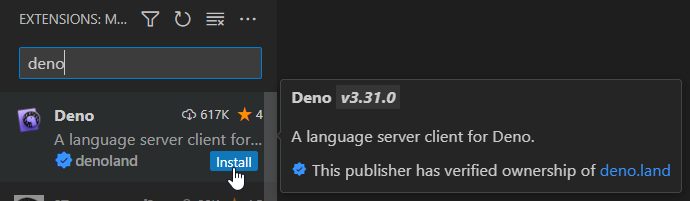
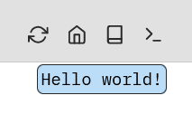
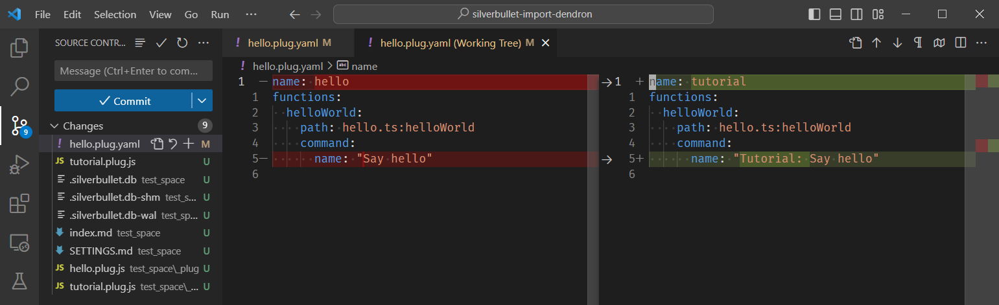
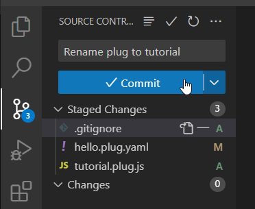
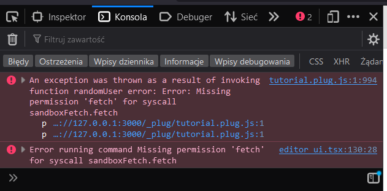

## Prerequisites
This tutorial assumes very little prior knowledge, other than ability to run a command in the terminal or some basic programming terms like “variable” or “function”.

It’s advised to do the tutorial as you are reading it, but if you would prefer to see the final result, check [this GitHub repository](https://github.com/Maarrk/silverbullet-plug-tutorial).

The instructions have been tested on Linux, Windows, and Windows Subsystem for Linux (WSL) operating systems. I assume it works the same on Mac.
The commands have been adjusted (like replacing `&&` with `;`) to work both in Bash and recent versions of PowerShell.

### Installation
Most of the following tools are theoretically optional for plug development, but will be used in this tutorial.

- [GitHub](https://github.com/) account (click “Sign Up” in the top right)
- [Git](https://git-scm.com/) client
- [Deno runtime](https://deno.com/) installed locally
- Code editor, Deno [supports](https://docs.deno.com/runtime/manual/references/vscode_deno/) [VS Code](https://code.visualstudio.com/) (or [VSCodium](https://vscodium.com/))
- [Deno extension for VS Code](https://marketplace.visualstudio.com/items?itemName=denoland.vscode-deno)
  1. Open “Extensions” in VS Code left toolbar (`Ctrl+Shift+X`)
  2. Search for “deno”
  3. Install “Deno” extension by “✔denoland”
- SilverBullet [installed locally](https://silverbullet.md/Install/Deno)
  - When using Windows, you might need to manually add the directory `%userprofile%\.deno\bin` to Path variable ([guide on SO](https://stackoverflow.com/questions/44272416/how-to-add-a-folder-to-path-environment-variable-in-windows-10-with-screensho))

### Git setup
There are multiple opinions on the topic, and multiple guides online, here is an abridged instruction as advised by the author:
- Set username and email
  (`git config --global user.name "User"`,
  `git config --global user.email “user@example.com”`)
- Generate SSH key (`ssh-keygen -t ed25519`)
- Add it to GitHub account (GitHub -> Settings -> SSH Keys -> paste contents of`~/.ssh/id_ed25519.pub`)

## Get a local copy of the template
Log in to GitHub and open [silverbullet-plug-template](https://github.com/silverbulletmd/silverbullet-plug-template) repository. Click on the green “Use this template button” and choose “Create a new repository”.

Fill in the “Repository name” field, for example “silverbulet-plug-tutorial”. Choose “Public” or “Private” below, as appropriate, and confirm by clicking on green “Create repository” button.

> **warning** Warning
> The repository name you choose here will be used later to install your plug. It is advised that you don’t change repository names once created.

On the repository page, click on the green “Clone” button. If you set up SSH in the previous step, then choose “SSH” here. Copy the address below (there is a button on the right), and open your terminal where you want to place the project folder.

Type `git clone ` and paste the address from previous step, for a command like:
```bash
git clone git@github.com:<username>/silverbullet-plug-tutorial.git
```

Open the project folder in your code editor. (If you installed VS Code, run `code ./silverbullet-plug-tutorial` in the same terminal)

## Opening a test space
Create a new directory `test_space` under the project directory. Run SilverBullet in that space:
```bash
mkdir test_space
silverbullet test_space
```

The output should end with a line like:
```
SilverBullet is now running: http://127.0.0.1:3000
```
Visit this address in your browser, and verify you see an index page of a newly created space. Many terminal environments (including VS Code) let you open links if you click them while holding down `Ctrl` key.

## Trying out the plug in action
Leave SilverBullet running, and open a new terminal (in VS Code you can click on the “+“ icon in the top right part of the terminal area). If you come back to this tutorial, remember to have it running in the background for the subsequent steps.

Create a `_plug` folder in the test space directory. Then build the plugin and copy the plug files there:
```bash
mkdir test_space/_plug
deno task build
cp *.plug.js test_space/_plug
```

> **note** Note
> As of writing this tutorial, the project is still in early stage, and things may change quickly. In case you run into problems, consult also the [template README](https://github.com/silverbulletmd/silverbullet-plug-template/blob/main/README.md) and the [template issues](https://github.com/silverbulletmd/silverbullet-plug-template/issues), to get the information most up to date with the code.

To make it convenient to synchronize the plug changes, add the following text to the index page of your test space `{[Sync: Now]}`. It should be displayed as a button. Click it now, you should see the messages “Syncing space...” and “Done.”.

This “Sync: Now” action is an example of a [[!silverbullet.md/Commands|command]], so it can be run via a button (like you just did), or found in [[!silverbullet.md/Command Palette]]. 

Open Command Palette now, by pressing `Ctrl+/` or clicking the `>_` icon in the top right of SilverBullet window. Search for “hello”, if you built and installed the plugin successfully, you should see a command named “Say hello”. Click it or press `Enter` when it’s highlighted. You should see the message “Hello world!” appear briefly in the top part of the screen: 
Congratulations, you just installed and ran custom code in SilverBullet! 🎉

## Saving changes with Git
> **note** Note
> To keep the tutorial simple and beginner-friendly, this workflow will include the built plugin in the repository, which is normally supposed to only contain source files.
> For other ways of publishing and installing plugins, like GitHub Releases, see [[!silverbullet.md/Plugs/Development]] and [[!silverbullet.md/Plug Management]].

Let’s make some simple edit in the source code. Open `hello.plug.yaml`, and change it like the following:
```yaml
name: tutorial # < edit here
functions:
  helloWorld:
    path: hello.ts:helloWorld
    command:
      name: "Tutoral: Say hello" # edit here
```

Now build and install the plug: $build-and-install
```bash
deno task build; cp *.plug.js test_space/_plug/
```

Note that since we changed the plug name in the `.plug.yaml` file, now it was compiled to `tutorial.plug.js`. Remove file `hello.plug.js`.

### Ignoring unwanted files
If you go to “Source Control” view (`Ctrl+Shift+G`), you should see that `hello.plug.yaml` is marked as **M**odified, and there are some other files created, but still **U**ntracked.
The same can be shown in terminal:
```
$ git status
On branch main
Your branch is up to date with 'origin/main'.

Changes not staged for commit:
  (use "git add <file>..." to update what will be committed)
  (use "git restore <file>..." to discard changes in working directory)
        modified:   hello.plug.yaml

Untracked files:
  (use "git add <file>..." to include in what will be committed)
        test_space/
        tutorial.plug.js

no changes added to commit (use "git add" and/or "git commit -a")
```

We could manually choose every time which files are included in the repository, but it’s a good idea to set this permanently. Create a file called `.gitignore`, and add the following line to it:
```
test_space/
```

Now `git status` should have output like the following
```
Changes not staged for commit: (...)
        modified:   hello.plug.yaml

Untracked files: (...)
        .gitignore
        tutorial.plug.js
```
Note that anything in the `test_space/` is not being shown here.

### Making a commit
All history in git is saved at specific points called commits. To put our new code on GitHub we first need to create a commit with the changes, and then synchronize (“push”) it to GitHub.

Sill in the “Source Control” view, click the “+“ button on the right of “Changes”, to stage them for inclusion in commit. Then write a short commit message describing what we just did, and click “Commit”, then “Sync changes”. 

In the terminal you can do these steps as:
```
git add .
git commit -m "Rename plug to tutorial"
git push
```

Now visit the repository page that you created before, and verify that the file `tutorial.plug.js` is present. If it was already open, you might need to refresh it (`F5` in most browsers) to see the changes.

### Renaming files
Notice that Git is able to track specifically which lines in files are changed, or that a file has been renamed.

Rename the files starting with `hello*` to `tutorial.plug.yaml` and `tutorial.ts`. Also update old filenames in the `.plug.yaml` file and `deno.jsonc` to point to new ones.

After renaming the files, Git will show that they are deleted, and two new files are created and untracked:
```
Changes not staged for commit: (...)
        deleted:    hello.plug.yaml
        deleted:    hello.ts

Untracked files: (...)
        tutorial.plug.yaml
        tutorial.ts
```

But after staging (for example with `git add .`), they should be recognized as renames:
```
Changes to be committed: (...)
        renamed:    hello.plug.yaml -> tutorial.plug.yaml
        renamed:    hello.ts -> tutorial.ts
```

Commit this with a descriptive message, and push as before.

## Where to find examples
At the moment of writing there is little documentation available on how to write new plugs. Fortunately, parts of SilverBullet itself have been built using plugs (a practice known as [dogfooding](https://en.wikipedia.org/wiki/Eating_your_own_dog_food)).

So a good resource for building a plug with a given functionality is to find a plug that does something similar. Links to existing plugs can be found at:
- [[!silverbullet.md/Plugs]] page in SilverBullet docs
- [silverbulletmd organization](https://github.com/silverbulletmd) on GitHub

## Fetching external data
Based on [GitHub](https://github.com/silverbulletmd/silverbullet-github/tree/main) and [Mastodon](https://github.com/silverbulletmd/silverbullet-mastodon) plugs.

> **warning** Warning
> This part of the tutorial will make requests to real pages. This means you don’t need to set up any extra servers, but need Internet connection to test it.

We’ll be using the [JSONPlaceholder](https://jsonplaceholder.typicode.com/) service as an example of a public [REST API](https://en.wikipedia.org/wiki/REST), which is a popular way to make information from one application available to other apps (it’s an Application Programming Interface).

### Basic command with online data
Following the example of different Plugs, we’ll get the data using the [Fetch API](https://developer.mozilla.org/en-US/docs/Web/API/Fetch_API). Add the following code below `helloWorld()` in `tutorial.ts`:
```typescript
export async function randomUser() {
  const result = await fetch("https://jsonplaceholder.typicode.com/users/1");
  if (result.status < 200 || result.status >= 300) {
    // Handle HTTP error here
    throw new Error(await result.text());
  }
  const data = await result.json();

  await editor.flashNotification(data["name"]);
}
```

We also need to register the function in the `.plug.yaml` file, which defines the parts of your plug that SilverBullet needs to know about (in many projects such file is called a manifest). Add the following under `functions:` key:
```yaml
  randomUser:
    path: tutorial.ts:randomUser
    command:
      name: "Tutorial: Show random user name"
```

You  the plugin, and verify that the command “Tutorial: Show random user name” is present in the palette.

Try running the command now, *but we expect no result to happen*. This is because [[!silverbullet.md/PlugOS]], the system for running plugs puts them in sandboxes with limited access.

To diagnose errors in plugs, **use the browser’s Developer Tools (`F12` in most browsers)**. Open the console, and look at the error message added when you try to run the command: 
To fix this, we need to define that we require the fetch permission in the `.plug.yaml` file:
```yaml
name: tutorial
requiredPermissions:
  - fetch
functions:
# (...)
```

After building and installing, the command should now show a message after running, like “Leanne Graham” at the time of writing.

> **note** Note
> You can put information here from any point in your code by calling `console.log`, `console.error`, or [other functions](https://developer.mozilla.org/en-US/docs/Web/API/console)
>
> Try it now, by adding the following at the end of `randomUser()`:
```typescript
console.log(data);
```

### Configuration and better error handling
The features provided in SilverBullet for plug authors (the plug API) include tools for configuring your code from the [[SETTINGS]] page, just like the editor features.

To choose a random user, instead of always the first one, we’ll add a configurable user count to choose from. Add the following line at the start of `tutorial.ts`:
```typescript
import { readSettings } from "$sb/lib/settings_page.ts"
```
And get the settings at the start of `randomUser()`:
```typescript
export async function randomUser() {
  const config = await readSettings({ userCount: 1 });
// (...)
}
```
Here we provide a default value to handle a situation when the user has not added anything to settings page

Check the contents of the `config` object using `console.log`. Add a line like `userCount: 5` to [[SETTINGS]] and try again. This should work for this single function, but it would be more organized both for us and the users if we put the settings in a separate object, so it’s clear what features can be configured.

Since we’re using (as you can tell by the `.ts` file extension), we’ll define a nice and clear type for the configuration, with a default object that we can use consistently in all functions. Place these definitions right after the `import` statements:
```typescript
type TutorialConfig = {
  userCount: number,
};

const defaultConfig: TutorialConfig = {
  userCount: 1,
}
```

Change the code to call `readSettings(defaultConfig)` now, the results should be the same.
> **note** Note
> VS Code and some other editors may now give you more information about the `config` variable, since we defined its type. Try hovering over it with a mouse or typing `config.` (name followed by dot) to see what is contained in it

It’s finally time to move the config inside a common key in [[SETTINGS]]. Change the import to `readSetting`, notice no “s” at the end. We want to get the make the object with default values, and override them with whatever we find. We can do it by unpacking those two into our `config` object with the `...` operator.

```typescript
const settingsKey = "tutorialPlug";
const config = { ...defaultConfig, ...(await readSetting(settingsKey, {})) };
```
And update the part of [[SETTINGS]] accordingly:
```yaml
tutorialPlug:
  userCount: 5
```
You can expect that we will need this `“tutorialPlug"` string every time we load a configuration. Make it a global variable, by moving its definition above `TutorialConfig`.

To finally get a random user number between one and `userCount` we’ll consult the [documentation of `Math.random()`](https://developer.mozilla.org/en-US/docs/Web/JavaScript/Reference/Global_Objects/Math/random). Put the following incantation after the definition of `config`:
```typescript
const selectedUserId = 1 + Math.floor(Math.random() * config.userCount);
```

The next step is to put this number data into text, a task known as “string interpolation”:
```typescript
`https://jsonplaceholder.typicode.com/users/${selectedUserId}`
```
Notice that the double quotes on both ends of the string have been replaced with backticks, and whatever we need to put inside the string is now inside `${...}` braces. Try the command now, you should be getting up to 10 or `userCount` different results, whichever is less.

If you make the `userCount` larger than 10, sometimes you won’t get any message, but an error will appear in the console. It would be better to notify the user of a possible misconfiguration than error silently. The same `flashNotification` function we use to display the successful result, also accepts an optional second parameter, to show an error message.
```typescript
if (result.status < 200 || result.status >= 300) {
  // Handle HTTP errors here
  if (result.status == 404) {
    await editor.flashNotification(
      "Couldn't fetch random user, ensure userCount is not greater than 10",
      "error"
    );
    return;
  } else throw new Error(await result.text());
}
```

### TODO: Query with online data
Write a code block like GitHub plug, with query events

## TODO: Modifying the space
Get notes with frontmatter satisfying some criteria and change them