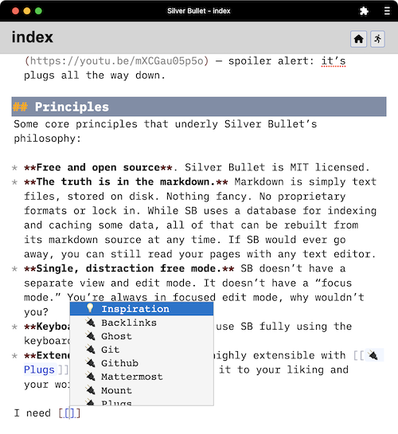

## Markdown as a platform
Silver Bullet (SB) is highly-extensible, [open source](https://github.com/silverbulletmd/silverbullet) **personal knowledge management** software. Indeed, that’s fancy language for “a note taking app with links.”

Here is a screenshot:

At its core, SB is a Markdown editor that stores _pages_ (notes) as plain markdown files in a folder referred to as a _space_. Pages can be cross-linked using the `[[link to other page]]` syntax. However, once you leverage its various extensions (called _plugs_) it can feel more like a _knowledge platform_, allowing you to annotate, combine and query your accumulated knowledge in creative ways, specific to you. To get a good feel for it, [watch this video](https://youtu.be/RYdc3UF9gok).

Or [try it in a sandbox demo environment](https://demo.silverbullet.md/Sandbox).

## Extensions
What type of extensions, you ask? Let us demonstrate this in a very meta way: by querying a list of plugs and injecting it into this page!

Here’s a list of (non-built in) plugs documented in this space (note the `#query` ... `/query` notation used):

<!-- #query page where type = "plug" order by name render [[template/plug]] -->
* [[🔌 Backlinks]] by **Guillermo Vayá** ([repo](https://github.com/Willyfrog/silverbullet-backlinks))
* [[🔌 Core]] by **Silver Bullet Authors** ([repo](https://github.com/silverbulletmd/silverbullet))
* [[🔌 Ghost]] by **Zef Hemel** ([repo](https://github.com/silverbulletmd/silverbullet-ghost))
* [[🔌 Git]] by **Zef Hemel** ([repo](https://github.com/silverbulletmd/silverbullet-github))
* [[🔌 Github]] by **Zef Hemel** ([repo](https://github.com/silverbulletmd/silverbullet-github))
* [[🔌 Mattermost]] by **Zef Hemel** ([repo](https://github.com/silverbulletmd/silverbullet-mattermost))
* [[🔌 Mount]] by **Zef Hemel** ([repo](https://github.com/silverbulletmd/silverbullet-mount))
* [[🔌 Query]] by **Silver Bullet Authors** ([repo](https://github.com/silverbulletmd/silverbullet))
<!-- /query -->.

In a regular SB installation, the body of this query 👆 (in between the placeholders) would automatically be kept up to date as new pages are added to the space that match the query. 🤯 Have a look at the [[template/plug]] _template_ (referenced in the `render` clause) to see how the results are rendered using handlebars syntax, and have a look at one of the linked pages to see how the _meta data_ is specified, which is subsequently used to query and render in this page. And to learn about the specific plug, of course.

## Explore more
Click on the links below to explore various aspects of Silver Bullet more in-depth:

* [[CHANGELOG]]
* [[🤯 Features]]
* [[💡 Inspiration]]
* [[🔌 Plugs]]
* [[🔨 Development]]

More of a video person? Here’s two to get you started:

* [A Tour of Silver Bullet’s features](https://youtu.be/RYdc3UF9gok) — spoiler alert: it’s cool.
* [A look the SilverBullet architecture](https://youtu.be/mXCGau05p5o) — spoiler alert: it’s plugs all the way down.

## Principles
Some core principles that underly Silver Bullet’s philosophy:

* **Free and open source**. Silver Bullet is MIT licensed.
* **The truth is in the markdown.** Markdown is simply text files, stored on disk. Nothing fancy. No proprietary formats or lock in. While SB uses a database for indexing and caching some data, all of that can be rebuilt from its markdown source at any time. If SB would ever go away, you can still read your pages with any text editor.
* **Single, distraction free mode.** SB doesn’t have a separate view and edit mode. It doesn’t have a “focus mode.” You’re always in focused edit mode, why wouldn’t you?
* **Keyboard oriented**. You can use SB fully using the keyboard, typin’ the keys.
* **Extend it your way**. SB is highly extensible with [[🔌 Plugs]], and you can customize it to your liking and your workflows.

## Installing Silver Bullet
For this you will need to have a recent version of [node.js installed](https://nodejs.org/en/) (16+). Silver Bullet has only been tested on MacOS and Linux thus far. It could also run on Windows, let me know if it does.

To install and run SB, create a folder for your pages (it can be empty, or be an existing folder with `.md` files) and run the following command in your terminal:

    npx @silverbulletmd/server <path-to-folder>

Optionally you can use the `--port` argument to specify a HTTP port (defaults to `3000`) and you can pass a `--password` flag to require a password to access. Note this is a rather weak security mechanism, so it’s recommended to add additional layers of security on top of this if you run this on a public server somewhere (at least add TLS). Personally I run it on a tiny Linux VM on my server at home, and use a VPN (Tailscale) to access it from outside my home.

Once downloaded and booted, you will be provided with a URL to open SB in your browser (spoiler alert: by default this will be http://localhost:3000 ).

That’s it! Enjoy.

If you (hypothetically) find bugs or have feature requests, post them in [our issue tracker](https://github.com/silverbulletmd/silverbullet/issues). Want to contribute? [Check out the code](https://github.com/silverbulletmd/silverbullet).
