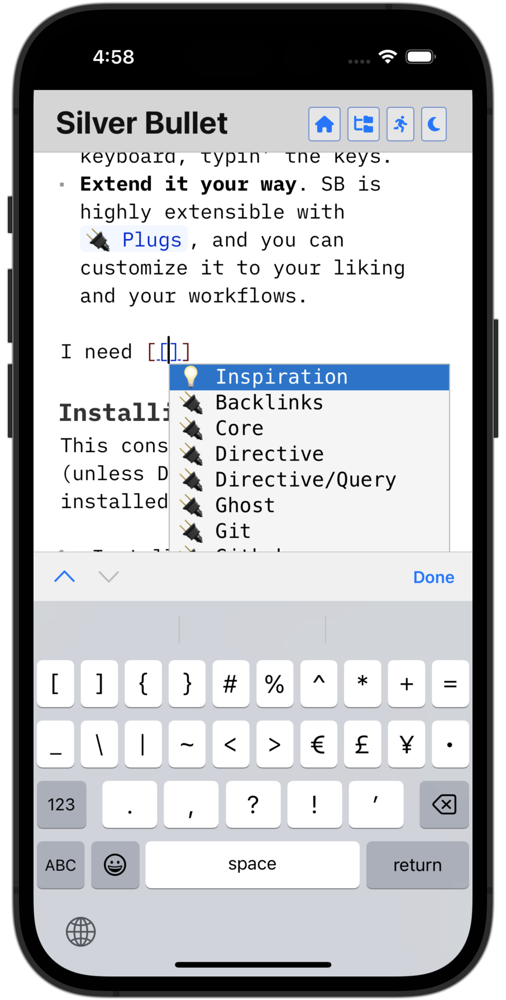

Silver Bullet is extensible, [open source](https://github.com/silverbulletmd/silverbullet), **personal
knowledge management** software. Indeed, that’s fancy language for “a note taking app with links.” Beside providing a nice [markdown](https://en.wikipedia.org/wiki/Markdown) editing experience (with live preview), it also enables annotating your content with additional metadata (using [[Frontmatter]]), which can then be queried using a query [[🔌 Directive]].

Here is a screenshot of Silver Bullet in PWA mode (Silver Bullet can be installed as a PWA on Chromium-based browsers):


It also works in mobile browsers:




But here’s the kicker:

==You are looking at a (more or less) operational copy of Silver Bullet **right now**==.

That’s right, this very website is powered by a quasi-read-only version of Silver Bullet itself. 🤯

Quasi-read-only because everything is editable as in a regular copy of Silver Bullet, just none of it persists.

## Try it out
* Click on the page picker (folder tree) icon at the top right, or hit `Cmd-k` (Mac) or `Ctrl-k` (Linux and Windows) to open the **page switcher**. Type the name of a nonexistent page to create it (although it won’t save in this environment).
* Click on the run button (top right) or hit `Cmd-/` (Mac) or `Ctrl-/` (Linux and Windows) to open the **command palette** (note that not all commands will work in this mode).
* Select some text and hit `Alt-m` to ==highlight== it, or `Cmd-b` (Mac) or `Ctrl-b` to make it **bold**.
* Click a link somewhere on this page to navigate there.
* Start typing `[[` somewhere to insert a page link (with completion).
* [ ] Tap this box 👈 to mark this task as done.
* Start typing `:party` to trigger the emoji picker 🎉
* Type `/` somewhere in the text to invoke a **slash command**.
* Hit `Cmd-p` (Mac) or `Ctrl-p` (Windows, Linux) to show a live preview for the current page on the side, if your brain doesn’t speak native Markdown yet.
* Open this site on your phone or tablet and… it just works!
* Are you using a browser with **PWA support** (e.g. any Chromium-based
  browser)? Click on that little icon to the right of your location bar that says “Install Silver Bullet” to give SB its own window frame and desktop icon, like it is a stand-alone app (not particularly useful on silverbullet.md, but definitely do this once you install it yourself).

Oh yeah, you can use fancy things like tables:

| Page | Comment |
|----------|----------|
| [[Silver Bullet]] | Main product page |
| [[CHANGELOG]] | The latest updates |

or code snippets, like JavaScript:

```javascript
function helloWorld() {
   return "Hello there!"
}
```

or YAML:

```yaml
name: Silver Bullet
rating: 5
```

Click into any of these and edit them.

There are a few features you don’t get to fully experience in this environment, because they rely on a working back-end, such as:

* Using Silver Bullet [[🔌 Directive]]s where part of pages are automatically rendered and kept up to date by querying various data sources (such as pages and their metadata, back links, tasks embedded in pages, and list items) with an SQL like syntax, rendered with handlebars templates.
* Intelligent **page renaming**, automatically updating any pages that link to it.
* **Full text search**.
* **Extending** and updating SB’s functionality by installing additional [[🔌 Plugs]] (SB parlance for plug-ins) and writing your own.


## Explain more, please
Silver Bullet is a Markdown editor that stores _pages_ (notes) as plain markdown files in a folder referred to as a _space_. Pages can be cross-linked using the `[[link to other page]]` syntax. However, once you leverage its various extensions (called _plugs_) it can feel more like a _knowledge platform_, allowing you to annotate, combine and query your accumulated knowledge in creative ways, specific to you.

Some things are just [better explained in a video](https://youtu.be/VemS-cqAD5k).

## Where to go from here
Click on the links below to explore various aspects of Silver Bullet more
in-depth:

* [[CHANGELOG]] — what’s new?
* [[🤯 Features]]
* [[💡 Inspiration]]
* [[🔌 Plugs]]
* [[🔨 Development]]

## Principles
Some core principles that underly Silver Bullet’s philosophy:

- **Free and open source**. Silver Bullet is MIT licensed.
- **The truth is in the markdown.** Markdown is simply text files, stored on disk. Nothing fancy. No proprietary formats or lock in. While SB uses a database for indexing and caching some data, all of that can be rebuilt from its markdown source at any time. If SB would ever go away, you can still read your pages with any text editor.
- **Single, distraction-free mode.** SB doesn’t have a separate view and edit mode. It doesn’t have a “focus mode.” You’re always in focused edit mode, why wouldn’t you?
- **Keyboard oriented**. You can use SB fully using the keyboard, typin’ the keys.
- **Extend it your way**. SB is highly extensible with [[🔌 Plugs]], and you can customize it to your liking and your workflows.

## Installing Silver Bullet
This consists of two steps (unless Deno is already installed:

1. [Install Deno](https://deno.land/manual/getting_started/installation)
2. Installing Silver Bullet itself

### Install Silver Bullet
With [Deno installed](https://deno.land/manual/getting_started/installation), run:

```shell
deno install -f --name silverbullet -A --unstable https://get.silverbullet.md
```

This will install `silverbullet` into your `~/.deno/bin` folder (which should already be in your path if you followed the Deno install instructions).

To run Silver Bullet, create a folder for your pages (it can be empty, or be an existing folder with `.md` files) and run the following command in your terminal:

```shell
silverbullet <pages-path>
```

By default, Silver Bullet will bind to port `3000`, to use a different port use the the `--port` flag.

Once downloaded and booted, Silver Bullet will print out a URL to open SB in your browser (spoiler alert: by default this will be http://localhost:3000 ).

## Upgrading Silver Bullet
Simply run:

    silverbullet upgrade

And restart Silver Bullet. You should be good to go.

## Troubleshooting

If you upgraded to the new Deno-based Silver Bullet from an old version, you may have to use the `silverbullet fix <pages-path>` command to flush out your old database and plugs. Plugs will likely need to be updated.

If you (hypothetically) find bugs or have feature requests, post them in
[our issue tracker](https://github.com/silverbulletmd/silverbullet/issues). Want to contribute? [Check out the code](https://github.com/silverbulletmd/silverbullet).
