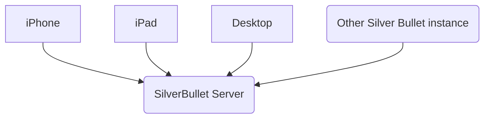

SilverBullet now has a sync engine. Let’s still consider it _experimental_, but it’s ready for use.

The synchronization algorithm implemented is [pretty much this one described here](https://unterwaditzer.net/2016/sync-algorithm.html).

## Architecture
You’ll use a single SilverBullet [[Server]] as your central synchronization space, then connect any other instances of SilverBullet (likely primarily [[Mobile]] and [[Desktop]] apps, but could also be other [[Server]] instances) to it. Each “client” instance keeps track of sync snapshots that it uses to figure out what files have changed where.

Let’s put this information in a graph, just because we can!

## Usage
Here’s how to use SilverBullet’s sync functionality:

1. Set up a SilverBullet [[Server]] somewhere where all your other devices have access to it. This can be your local network, a VPN, or if you’re living the wild life — the public Internet (do put some SSL and authentication on it please).
2. Connect any other SilverBullet instance (likely the [[Desktop]] or [[Mobile]] app) to it via the {[Sync: Configure]} command. This will ask for:
   * A URL to connect to (the URL of the SB server configured under (1))
   * A username and password (optional) if you run the server with the `--user myuser:mypass` flag (as you should)
3. {[Sync: Sync]} performs a sync. It stores a local sync snapshot (basically a list of timestamps for all files in your space) in its local SQLite database every time.
4. Check {[Show Logs]} for sync logs.

Right now, sync needs to be triggered manually, so run {[Sync: Sync]} whenever you feel a sync is warranted.

## The sync process
1. The sync engine compares two file listings: the local one and remote one, and figures out which files have been added, changed and removed on both ends. It uses timestamps to determine changes. Note this doesn’t make any assumptions about clocks being in sync, timezones etc.
2. In most cases, based on this info (together with the snapshot from the last sync) it should be obvious what to do, and it will do just do it.
3. In case of a conflict — which would happen if files on both ends have been changed since the last sync, it will first pull down both files and compare their content. If they’re the same, no issues. If they’re different: a conflicting copy will be created with a name of `page name.conflicted.timestamp`. You’ll see those appear in your page list.

## Caveats
* This is new code, and not been extremely thoroughly tested. Make backups.
* The sync engine doesn’t synchronize `_plugs` code, so to update the plug list based on your [[PLUGS]] you have to manually run {[Plugs: Update]}.

So, if you’re ready for this. Go try it. We do recommend: make regular backups in case the proverbial shit hits the fan, don’t say we didn’t warn you!